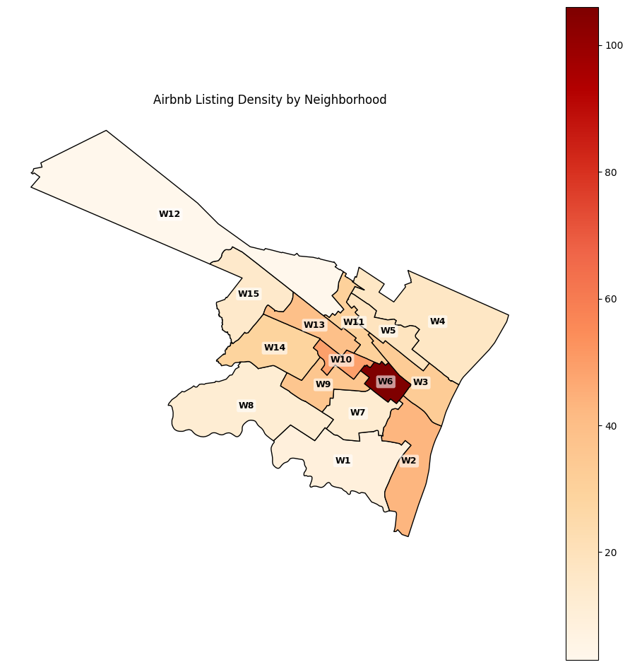
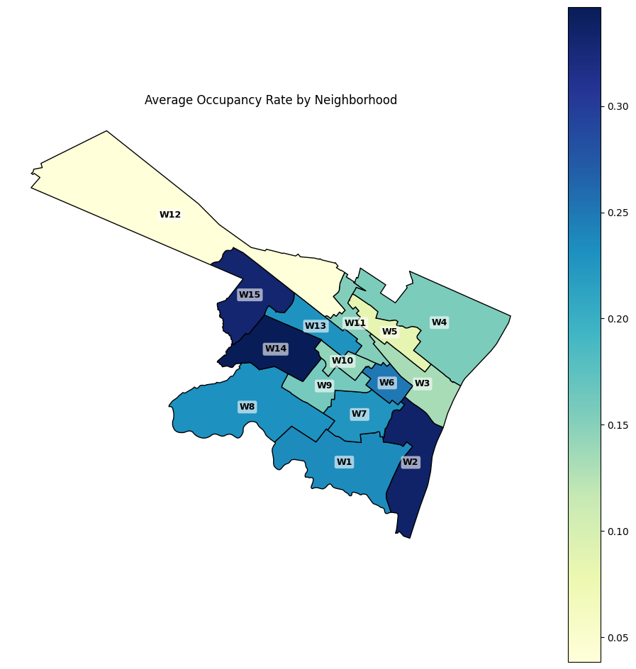
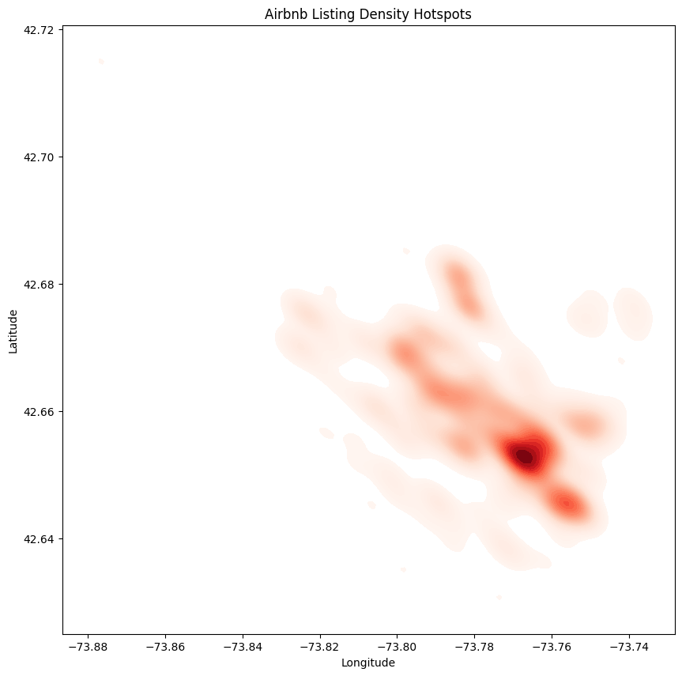
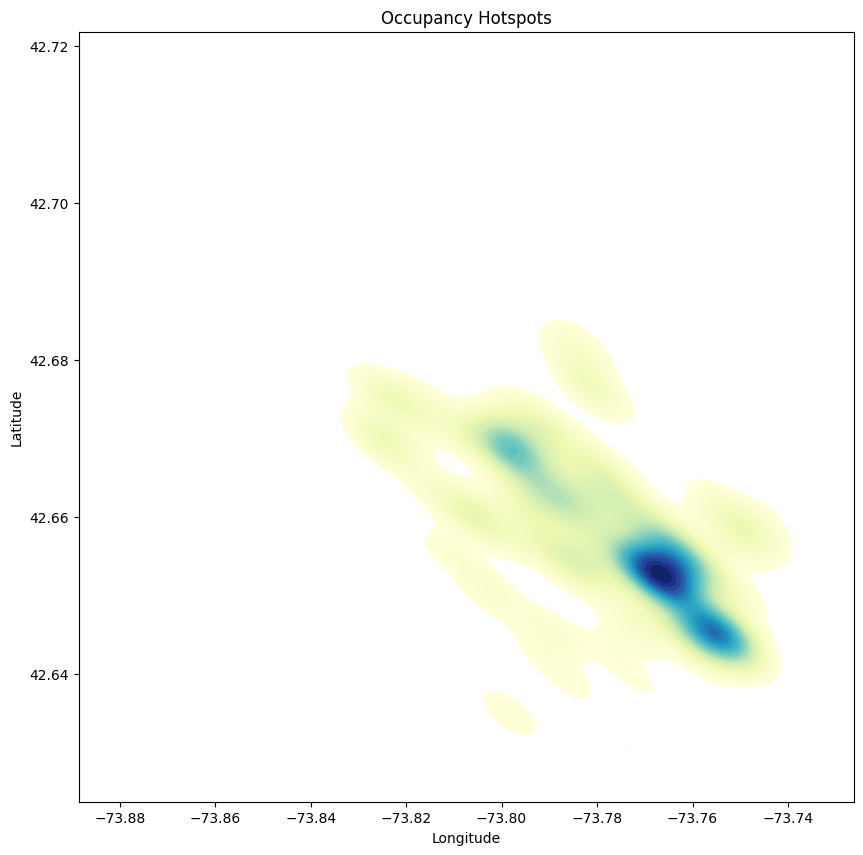
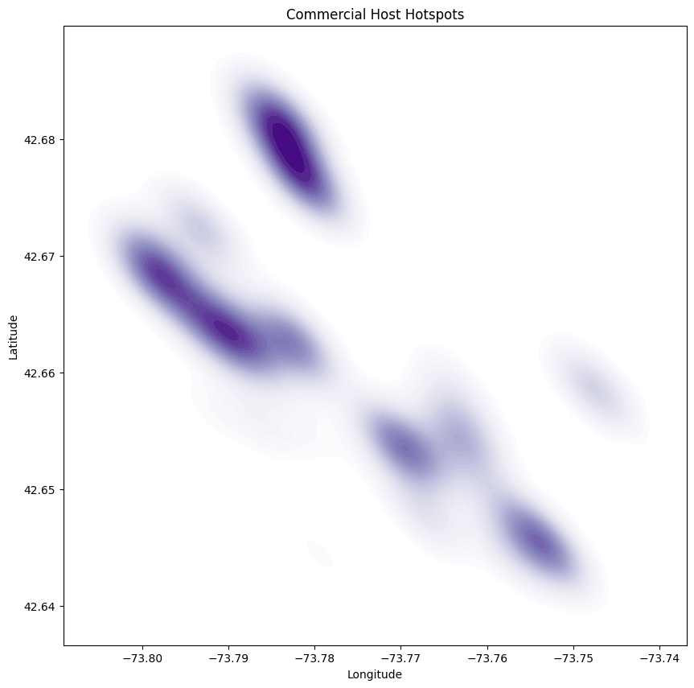
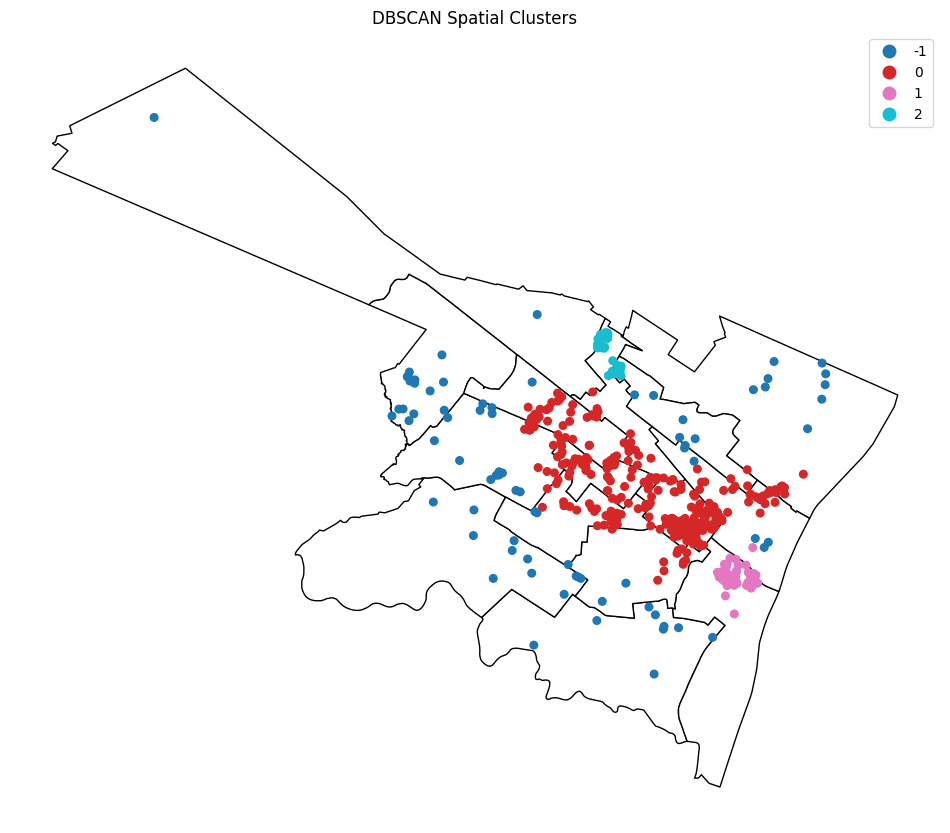
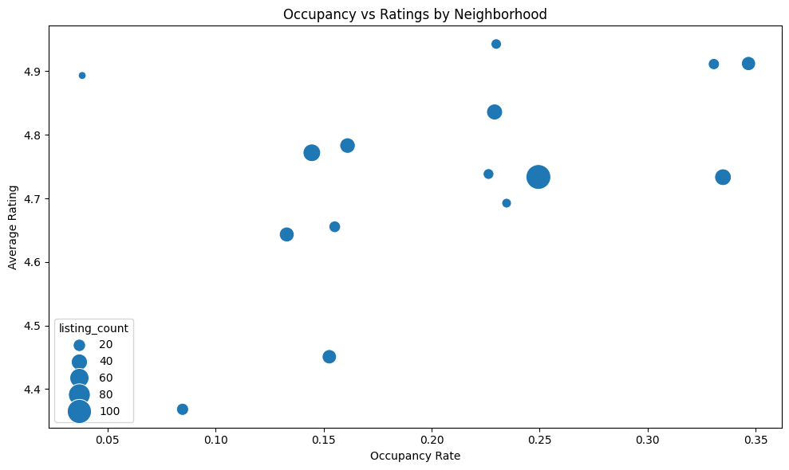

# 🗺️ Geospatial Marketplace Intelligence — Albany Airbnb

> *Uncovering hidden spatial structures, demand dynamics, and commercialization patterns in Albany's short-term rental ecosystem.*


---

## 📌 Table of Contents

- [Project Overview](#-project-overview)
- [Business Problem](#-business-problem)
- [Dataset](#-dataset)
- [Analytical Workflow](#-analytical-workflow)
- [Key Findings](#-key-findings)
- [Visual Highlights](#-visual-highlights)
- [Tech Stack](#-tech-stack)
- [Limitations](#-limitations)
- [Business Recommendations](#-business-recommendations)
- [Future Improvements](#-future-improvements)
- [Project Structure](#-project-structure)
- [Conclusion](#-conclusion)

---

## 🔍 Project Overview

This project investigates the **spatial structure and marketplace behavior** of Airbnb listings across Albany, New York, using a combination of geospatial analytics, occupancy modeling, hotspot detection, and density-based clustering.

Rather than treating Albany's Airbnb market as a single uniform entity, this analysis asks a more interesting question:

> **How does Airbnb activity cluster spatially — and what does that geography reveal about demand efficiency, commercialization, and neighborhood-level market structure?**

The project combines:

- 🧹 Data cleaning & feature engineering
- 📊 Exploratory data analysis (EDA)
- 🗺️ Geospatial choropleth visualization
- 🌡️ KDE hotspot detection
- 🔵 DBSCAN spatial clustering
- 🏙️ Marketplace segmentation & business interpretation

---

## 💼 Business Problem

Short-term rental markets are inherently **spatial**. Listings aren't evenly distributed, and occupancy, satisfaction, and commercial intensity vary dramatically from block to block.

Understanding these patterns matters for:

| Stakeholder | Why It Matters |
|---|---|
| 🏠 Hosts | Optimize listing placement and performance |
| 💰 Investors | Identify efficient, high-demand submarkets |
| 🏛️ City Planners | Monitor rental saturation and housing impact |
| 📈 Analysts | Understand visitor and tourism activity patterns |
| 🔬 Researchers | Study urban marketplace dynamics |

**One key challenge:** pricing data was entirely missing from this dataset. Rather than treating this as a failure, the project adapted — shifting focus toward **occupancy behavior, review activity, and spatial demand signals** as primary intelligence indicators.

---

## 📦 Dataset

Sourced from the publicly available **Inside Airbnb** dataset for Albany, New York.

### Components

| File | Description |
|---|---|
| `listings.csv.gz` | Detailed listing-level information |
| `calendar.csv.gz` | Daily availability per listing |
| `reviews.csv.gz` | Guest review text and metadata |
| `neighbourhoods.geojson` | Albany ward boundaries (15 wards) |

### Scale

| Metric | Value |
|---|---|
| Total Listings | 453 |
| Calendar Records | 165,345 |
| Reviews | 27,892 |
| Neighborhoods | 15 wards |

### ⚠️ Data Quality Notes

- Pricing columns were **100% missing** across both listings and calendar files
- Several host-related fields contained complete null values
- Calendar unavailability ≠ confirmed bookings (addressed in occupancy methodology)
- Some wards had very low listing counts, reducing neighborhood-level reliability

---

## 🔄 Analytical Workflow

```
Raw Data
   │
   ▼
① Data Cleaning & Preprocessing
   │  → null handling, date parsing, boolean conversion,
   │    coordinate validation, neighborhood standardization
   ▼
② Feature Engineering
   │  → occupancy_rate, calendar occupancy proxy,
   │    amenities_count, availability_ratio, ward aggregations
   ▼
③ Exploratory Data Analysis
   │  → distributions, neighborhood comparisons,
   │    room-type behavior, review activity, correlations
   ▼
④ Geospatial Visualization
   │  → choropleth maps (density, occupancy, ratings, commercialization)
   │    listing scatter maps, ward-level overlays
   ▼
⑤ Hotspot Detection (KDE)
   │  → listing density hotspots
   │    occupancy hotspots
   │    commercial host concentration maps
   ▼
⑥ DBSCAN Spatial Clustering
   │  → density-based cluster detection
   │    noise/outlier identification
   │    submarket segmentation
   ▼
⑦ Marketplace Intelligence & Business Interpretation
      → findings, recommendations, limitations
```

### Key Features Used

| Feature | Role |
|---|---|
| `occupancy_rate` | Primary demand signal |
| `estimated_occupancy_from_calendar` | Availability-based proxy |
| `reviews_per_month` | Activity / engagement indicator |
| `number_of_reviews` | Marketplace engagement volume |
| `amenities_count` | Listing quality proxy |
| `review_scores_rating` | Guest satisfaction |
| `calculated_host_listings_count` | Commercialization indicator |
| `latitude` / `longitude` | Spatial positioning |

---

## 🔑 Key Findings

### 1. 📍 Airbnb Supply Is Highly Centralized

Listings cluster heavily in a handful of central wards — particularly **W6, W10, W2, and W13**. The spatial distribution is far from uniform, following classic urban-centrality patterns with a dominant core and scattered peripheral activity.

### 2. ⚖️ High Supply ≠ High Occupancy

**W6** holds the most listings but does **not** lead in occupancy. Meanwhile, **W14, W15, and W2** demonstrate stronger occupancy performance with comparatively fewer listings — suggesting these wards operate as more efficient submarkets.

### 3. 🌡️ Demand Hotspots Diverge from Supply Hotspots

KDE analysis shows that **occupancy hotspots are more geographically concentrated** than listing-density hotspots. Certain zones attract disproportionate demand relative to supply — indicating either underserved demand or stronger location desirability.

### 4. 🏢 Commercial Operators Target the Urban Core

Professional hosts managing multiple listings cluster tightly around **W2, W6, W10, and W11** — directly overlapping the highest-density Airbnb zones. This reflects deliberate marketplace optimization toward high-traffic corridors.

### 5. 📉 Heavy Commercialization Correlates with Weaker Performance

DBSCAN-identified commercialized clusters showed **lower occupancy rates and lower guest satisfaction scores** — suggesting that aggressive multi-listing scaling may introduce:
- Oversupply effects
- Reduced service quality
- Operational dilution

This was one of the project's strongest marketplace-level insights.

### 6. ⭐ Review Activity Is the Best Demand Proxy

Correlation analysis confirmed strong positive relationships between `occupancy_rate` and both `reviews_per_month` and `number_of_reviews`. In the absence of pricing data, **review activity functions as a reliable demand signal**.

### 7. 🛋️ Amenities Have Surprisingly Limited Impact

Despite significant variation in amenity counts, amenities showed only weak-to-moderate correlation with occupancy. **Location and market structure appear to outweigh feature volume** as occupancy drivers.

### 8. 🌟 Guest Satisfaction Is Geographically Stable

Most wards maintained average ratings above **4.6**, with relatively narrow variance. Spatial demand inequality is far more pronounced than spatial quality inequality — guests are satisfied almost everywhere, but demand concentrates selectively.

### 9. 🗺️ Albany Contains Multiple Distinct Airbnb Submarkets

DBSCAN clustering identified four meaningful market segments:

| Cluster | Character |
|---|---|
| 🔴 Core Urban Market (Cluster 0) | Dense mainstream Airbnb activity, central wards |
| 🩷 Efficient Demand Cluster (Cluster 1) | High occupancy, balanced supply, south corridor |
| 🩵 Commercialized Cluster (Cluster 2) | Operator-heavy, lower performance metrics |
| ⚫ Noise / Peripheral Listings | Dispersed, independent, low-density |

---

## 📸 Visual Highlights

### Airbnb Listing Density by Neighborhood
> Supply is dominated by W6 — but density alone doesn't drive demand.



---

### Average Occupancy Rate by Neighborhood
> W14, W15, and W2 outperform the high-supply core on occupancy efficiency.



---

### Airbnb Listing Density Hotspots (KDE)
> Supply intensity radiates outward from a tight southeast urban core.



---

### Occupancy Hotspots (KDE)
> Demand is even more concentrated than supply — pointing to a zone of true marketplace intensity.



---

### Commercial Host Hotspots (KDE)
> Professional operators cluster in multiple distinct corridors, not just the supply peak.



---

### DBSCAN Spatial Clusters
> Albany isn't one market — it's at least three, with a significant peripheral fringe.



---

### Occupancy vs. Guest Ratings by Neighborhood
> High occupancy and high ratings can coexist — but the relationship isn't simple.



---

## 🛠️ Tech Stack

| Library | Purpose |
|---|---|
| `pandas` | Data cleaning and manipulation |
| `numpy` | Numerical operations |
| `geopandas` | Geospatial dataframes and ward overlays |
| `matplotlib` | Visualization and choropleth mapping |
| `seaborn` | Statistical plotting |
| `scikit-learn` | DBSCAN clustering |
| `shapely` | Spatial geometry operations |
| `scipy` | KDE hotspot estimation |

---

## ⚠️ Limitations

**Missing Pricing Data**
The most significant constraint. Pricing columns were entirely absent, preventing revenue estimation or price-based analysis. All demand inference relied on occupancy and review signals.

**Occupancy Proxy Uncertainty**
Calendar-based occupancy estimates may overstate true bookings — hosts can manually block dates without actual reservations. The weak correlation between Airbnb's occupancy estimate and the calendar proxy reflects this ambiguity.

**Small Ward Sample Sizes**
Wards like W12 had very few listings, making their neighborhood-level averages statistically fragile.

**Static Snapshot**
The dataset captures a single point in time. Seasonal variation, long-term market evolution, and temporal demand shifts could not be analyzed.

---

## 💡 Business Recommendations

**1. Explore Efficient Submarkets**
W14 and W15 show strong occupancy with lower listing density — potentially representing less saturated, higher-efficiency entry points for new hosts or investors.

**2. Monitor Saturation in W6**
The highest-supply ward may be approaching or past a competitive saturation point. Hosts here should prioritize differentiation — service quality, unique amenity bundles, or niche targeting.

**3. Audit Commercial Scaling Strategies**
Commercialized clusters show lower occupancy and ratings. Operators with high listing counts should evaluate whether scaling is helping or hurting per-unit performance.

**4. Use Reviews as a KPI Proxy**
In the absence of direct revenue data, `reviews_per_month` is the most reliable available performance signal. Hosts and analysts should track this metric closely.

---

## 🚀 Future Improvements

- [ ] Integrate pricing data when available for revenue modeling
- [ ] Add temporal analysis to capture seasonality effects
- [ ] Perform NLP sentiment analysis on review text
- [ ] Build an interactive dashboard (Folium / Plotly Dash / Streamlit)
- [ ] Incorporate demographic or tourism datasets for demand context
- [ ] Apply Getis-Ord Gi* statistics for formal hotspot significance testing
- [ ] Develop predictive occupancy models using listing characteristics
- [ ] Analyze host response rate and behavior patterns

---

## 📁 Project Structure

```
albany-airbnb-geospatial/
│
├── data/
│   ├── raw/                    # Original downloaded files
│   │   ├── listings.csv.gz
│   │   ├── calendar.csv.gz
│   │   ├── reviews.csv.gz
│   │   └── neighbourhoods.geojson
│   └── processed/              # Cleaned and engineered datasets
│
├── notebooks/
│   ├── 01_data_cleaning.ipynb
│   ├── 02_eda.ipynb
│   ├── 03_geospatial_analysis.ipynb
│   └── 04_hotspot_clustering.ipynb
│
├── images/                    # All generated maps and charts
│
├── README.md
└── requirements.txt
```

---

## ✅ Conclusion

This project demonstrates how **geospatial analytics can extract meaningful marketplace intelligence from imperfect, price-absent rental data**.

By layering choropleth mapping, KDE hotspot detection, and DBSCAN clustering, the analysis revealed that Albany's Airbnb market is:

- **Spatially concentrated** — not evenly distributed
- **Commercially stratified** — with professional operators clustering in specific corridors
- **Occupancy-inefficient in high-supply zones** — where density doesn't translate to performance
- **Multi-segmented** — comprising at least three distinct spatial submarkets

The strongest takeaway: **supply concentration and heavy commercialization do not guarantee marketplace success**. The most efficient Airbnb submarkets in Albany are often not the ones with the most listings — they're the ones where demand and supply are in better balance.

Geospatial analysis, even on incomplete data, can uncover the hidden architecture of urban marketplaces.

---

<div align="center">
  <sub>Built with 🗺️ GeoPandas · DBSCAN · KDE · Matplotlib · Scikit-learn</sub>
</div>
